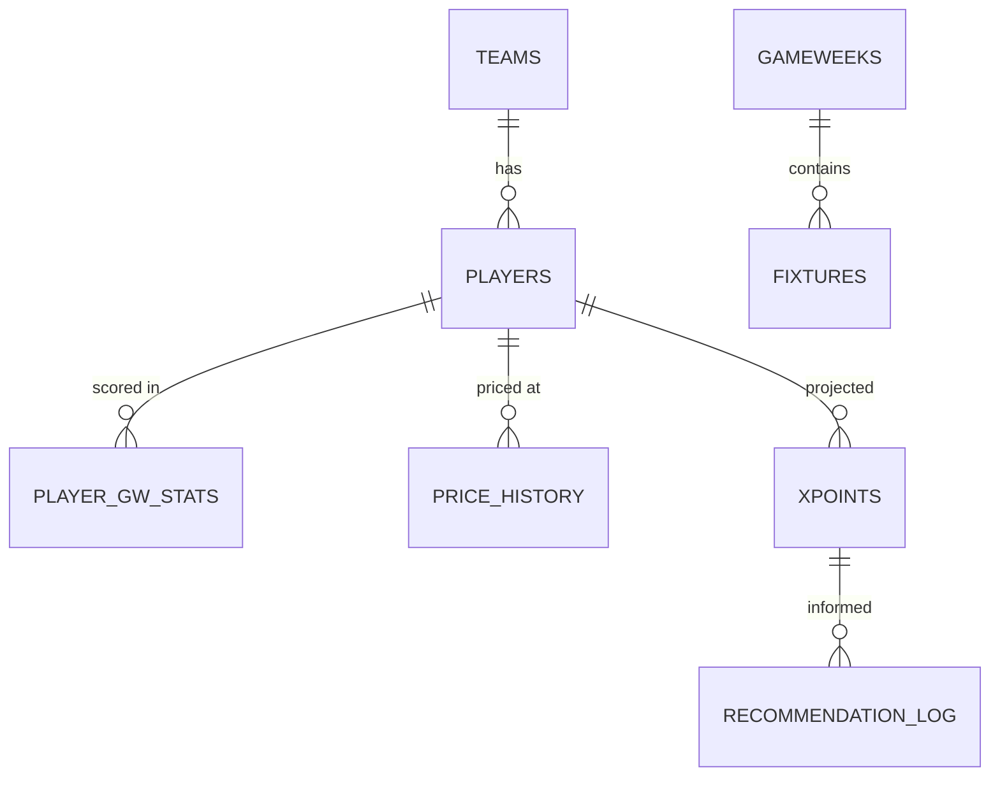
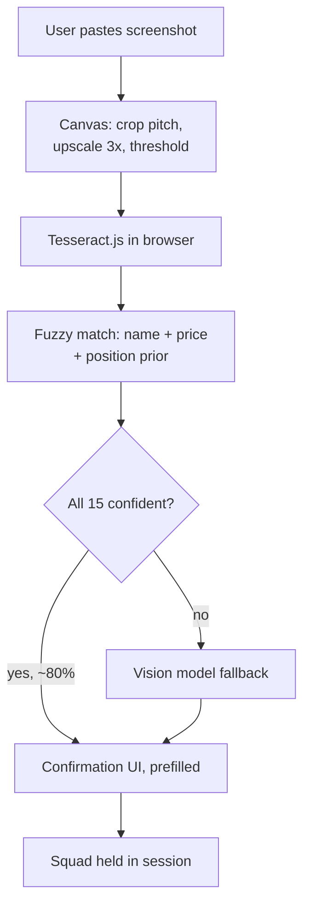

# FPL Optimizer — Architecture Plan

*Architecture plan — as of 2026-09-16*

## Scope

Build these as two separate products that meet at one HTTP boundary, and build the boring one first.

| System | What it is | Build order |
| --- | --- | --- |
| Ingest + web app | Next.js site, Postgres, screenshot parsing, squad state | First — weeks 1–6 |
| Optimizer | Python service: xPoints model + transfer/lineup solver | Second — starts as a stub |

The reason to split them is not elegance, it is that the optimizer is a research problem with no fixed finish line and the web app is a known quantity. If they share a codebase, the research swallows the product.

The boundary: the web app owns *state* (what the squad is and what it cost). The optimizer owns *math* and is stateless — it receives a squad plus a price list and returns recommendations. It never touches your database. That lets you rewrite the optimizer from scratch four times without migrations, and lets you ship the app with an optimizer that does nothing smarter than sorting by form.

## The data problem

You can almost certainly reconstruct selling prices from the public API without a screenshot. This is the single decision that most changes the build, so check it before writing any OCR code.

The gap you identified is real: `/api/my-team/{id}/` carries `selling_price` and `purchase_price`, and it requires a logged-in session cookie, so you cannot call it for another manager. But purchase price is derivable from two public endpoints:

1. `/api/entry/{id}/transfers/` — every transfer that manager has ever made, each row carrying `element_in`, `element_in_cost`, `element_out`, `element_out_cost` and the event number. The cost fields are the actual prices paid, in tenths.
2. `/api/bootstrap-static/` — for each player, `now_cost` and `cost_change_start`. Their difference is the player's price on day one, which is the purchase price for anyone still in the original squad.

So: walk the transfer log forward from the initial squad, and you know what the manager paid for every player they currently hold. Then apply FPL's selling rule — the seller keeps half of any rise, rounded down to the nearest £0.1m — and you have selling price exactly, for any public team, from a team ID alone.

**Verified live on 2026-09-17.** `entry/{id}/transfers/` returns rows carrying `element_in_cost` and `element_out_cost`, populated, in tenths. `bootstrap-static/` carries `now_cost` and `cost_change_start` for all 659 elements. Reconstructing a public team's squad from its transfer log produces plausible selling prices end to end.

One check remains open, and it needs your own logged-in account: whether the reconstruction matches FPL's *displayed* selling price to the tenth. It could not be closed from public data alone, because the comparison requires prices as of a past deadline and no historical price snapshots exist yet — which is why `price_history` is written from day one. Reconstructing a top-10 squad against today's prices lands within 0.3 of the value FPL reported at the GW4 deadline, and five days of price movement accounts for the gap. Confirm against your own Transfers screen before the screenshot path is demoted for good.

### What each source gives you

| Source | Auth | Gives you |
| --- | --- | --- |
| `bootstrap-static/` | none | All ~700 players: price, position, team, form, xG/xA, injury status, ownership |
| `fixtures/` | none | Every fixture + FDR for both sides |
| `element-summary/{id}/` | none | One player's per-gameweek history and upcoming fixtures |
| `entry/{id}/history/` | none | Per-GW points, rank, squad value, bank |
| `entry/{id}/event/{gw}/picks/` | none | Squad, captain, bench order — only after that GW's deadline |
| `entry/{id}/transfers/` | none | Full transfer log with prices paid |
| `my-team/{id}/` | cookie | Selling price, free transfers — own team only |

### Where the screenshot still earns its place

Two things stay genuinely unavailable, and they are what the screenshot path should be scoped to:

- **Pre-deadline state.** Picks for the upcoming gameweek are private until the deadline passes. A user planning transfers on Friday has a squad the API will not show until Saturday.
- **Onboarding friction.** Most managers do not know their team ID and will not go hunting for it in a URL.

That argues for a different priority than screenshot-first: make the API path primary and the screenshot an *alternate entry point* that fills the same squad object. Both paths produce one internal `SquadSnapshot`; the rest of the system never learns which one it came from. If the transfers-endpoint reconstruction turns out not to work, the screenshot path is already built and you simply promote it.

## Stack

Everything below has a free tier that covers a project with a few thousand users. Check current limits before you rely on the numbers — these are approximate and vendors move them.

| Layer | Pick | Why | Free-tier limit that matters |
| --- | --- | --- | --- |
| Web app | Next.js (App Router) on Vercel | Server components let you query Postgres directly, no separate API layer | Hobby forbids commercial use — see below |
| Database | Supabase Postgres | Reference data only; generous free Postgres with `pg_trgm` built in | ~500MB, project pauses after ~1 week idle |
| User state | Browser `localStorage` + URL encoding | No accounts, so nothing to secure and nothing to breach | None |
| Optimizer | FastAPI on Modal | Serverless Python, scales to zero, real CPU for solvers | ~$30/mo of credits, renewed monthly |
| Scheduled jobs | GitHub Actions cron | Free, never sleeps, lives next to your code | 2,000 min/mo private; unlimited if public |
| Screenshot parsing | Tesseract.js, vision model as fallback | Client-side OCR is free and private; see the parsing section | Fallback ~$0.003–$0.01/image |
| Errors | Sentry | Catches the OCR failures you will not reproduce locally | ~5k events/mo |

### The three choices worth arguing about

**Next.js, chosen for the skill rather than the fit.** Worth recording so this does not get re-argued later. Dropping accounts removed most of what Next.js is uniquely good at — server-side auth, per-user rendering, protected API routes. What remains is public read-only data plus one call to the Python service, which a plain Vite SPA on Cloudflare Pages would serve with less machinery. Next.js wins anyway on two grounds: it is the most transferable React skill to have, which is an explicit goal of this project, and server rendering keeps the pages findable in search. The price is a slower first fortnight.

Two things will cost you time, so expect them. The App Router's caching model is genuinely confusing — stale data that will not refresh is almost always a cache directive, not your code. And the server/client component boundary produces error messages that do not say what is wrong; when something breaks unexpectedly, check whether a `'use client'` is missing before debugging anything else. Use the App Router, not Pages, and do not mix tutorials between them.

**Vercel Hobby forbids commercial use.** If this stays a portfolio project, fine. The moment you take money — ads, subscriptions, anything — you need Pro at $20/mo, or you move to Cloudflare Pages or Netlify. Decide now whether that matters, because it is easier to not build a payments flow than to migrate hosting later.

**Modal over Render for the Python service.** Render's free tier spins down after 15 minutes idle and takes ~50 seconds to wake, which means the first user of every hour waits a minute for a recommendation. Modal cold-starts in a few seconds, gives you real CPU for the solver, and its credits reset monthly. The cost is a slightly unusual deployment model — you decorate Python functions rather than running a container. If you want a plain container instead, Google Cloud Run's free tier is the alternative and scales to zero properly.

**GitHub Actions over Vercel Cron for ingestion.** Vercel's hobby plan caps cron at roughly daily, and your data pull wants to run more often around deadlines and price changes (FPL prices update nightly at ~01:30 UTC). Actions gives you arbitrary schedules, a real Python environment, and logs you can read. It also means the ingestion code is a script you can run locally, which matters a lot when you are debugging a parser.

### Skip these

- **A separate Redis / queue.** Optimizing one squad takes seconds. Add a queue when you have a measured reason to.
- **Storing screenshots.** Parse, confirm with the user, discard. Storage costs nothing to avoid and it removes a privacy question you do not want.
- **An ORM you have to learn.** Supabase's generated TypeScript types plus plain SQL views will get you further, faster, than Prisma or Drizzle on a schema this small.

## Data model

With no accounts, the schema collapses to one half. Everything in the database is reference data that cron rebuilds and every visitor reads identically. Squad state lives in the browser and never reaches you.

This is a real simplification, not a compromise. No auth, no sessions, no password resets, no GDPR surface, no row-level security, no per-user quota accounting, and a database that is pure cache — if it is lost you re-run the ingestion script and you are whole.



### Reference tables (cron-owned, read-only to the app)

| Table | Key | Notes |
| --- | --- | --- |
| `teams` | (season, fpl_id) | 20 rows a season |
| `players` | (season, element_id) | Element ids are reassigned each season — never use one alone as a key |
| `gameweeks` | (season, gw) | Deadline timestamp is what your whole scheduler keys off |
| `fixtures` | fixture_id | Both FDR values, kickoff time, finished flag |
| `player_gw_stats` | (season, element_id, gw) | Minutes, points, xG, xA, bonus — the training set |
| `price_history` | (season, element_id, date) | Needed to reconstruct purchase prices and to predict rises |
| `xpoints` | (element_id, gw, model_version) | Model output, cached so the app never waits on inference |

### Where squad state lives instead

| Where | Holds | Why there |
| --- | --- | --- |
| `localStorage` | The current squad, bank, free transfers | Survives refresh, per device, costs nothing |
| URL fragment | A compact encoded squad string | Makes a result shareable — a free feature that would otherwise need accounts |
| `recommendation_log` table | `squad_hash`, gameweek, `model_version`, payload, timestamp | Anonymous, no identifier of any kind — purely so you can evaluate the model later |

The URL encoding is worth doing early. Fifteen element ids plus a bank figure compresses to a short base64 string, and it gives you shareable links, bookmarkable squads, and a trivial way to reproduce a user's bug report — all without storing anything.

### Four rules that will save you real pain

1. **Store money as integer tenths, never floats.** FPL prices are tenths of a million: 55 means £5.5m. The selling-price rule floors a halved difference, and floating point will hand you £4.999999m and an off-by-one squad value.
2. **Key players by (season, element_id).** FPL recycles element ids between seasons. A single-column key silently corrupts your historical training data in July.
3. **Log recommendations anonymously from day one.** A squad hash and the payload, no identifier. In eight weeks you will want to know whether your advice beat holding, and that is unreconstructable after the fact.
4. **Version the localStorage schema.** Put a version number in the stored object. Your squad shape will change, and without it, returning users hit a crash on a stale blob with no way to clear it.

## Screenshot to squad

No, you probably do not need an LLM for the common case — and with no accounts, plain OCR is a better fit than it would otherwise be. Build a cascade that tries the free path first.

Two facts make this easier than OCR usually is. An FPL screenshot is a *synthetic* image: crisp, anti-aliased text rendered at native resolution, not a photograph of a screen. Tesseract is good at that and bad at photographs. And you are matching against a closed set of ~700 known names at known prices, so you do not need *accurate* OCR, you need *recoverable* OCR. A read of "Sak4" at £10.2m still resolves to exactly one player.



### Why client-side OCR fits this project

Running Tesseract.js in the browser costs nothing, adds no server round-trip, and means the image never leaves the user's device — which matters a lot when you have deliberately chosen not to hold accounts. It also cannot be rate-limited or run up a bill if someone loops your endpoint.

Four things make it work much better than a naive attempt:

- **Upscale before thresholding.** Tesseract wants roughly 300 DPI equivalent. Phone screenshots of player names are small text; scale 3x with canvas before binarising, do not downscale.
- **Crop by proportion, not pixels.** The FPL layout is not fixed in pixels across devices, but the pitch is a fixed *proportion* of the viewport. Find the pitch region, then divide it into rows by ratio.
- **Feed Tesseract a user-words list.** It accepts a dictionary; give it all ~700 current player names. This measurably improves reads on exactly the strings you care about.
- **Restrict the character whitelist** for the price line to digits and a period.

### Where it will fail

Low-contrast white-on-bright text, the captain armband glyph read as a character, truncated long surnames in the mobile app, and anyone who photographs their screen rather than screenshotting it. Those are the cases that justify the vision fallback — guess 10–20% of uploads, which at a thousand uploads a month is a dollar or two, not a business model problem.

**Spend one afternoon before committing.** Collect ten real screenshots from friends — mixed iOS, Android, desktop, light and dark — and run Tesseract.js over them by hand. That tells you the true hit rate in a few hours and decides this question properly. If it lands above ~80%, the cascade is clearly right; below ~50%, skip straight to the vision model and save yourself the preprocessing work.

### Matching, concretely

Whatever reads the image, it should output only structure: per slot, the name text as printed, the price as printed, the slot index. No interpretation. Then match server-side:

- Enable `pg_trgm` in Supabase and score name similarity against `web_name` and full name.
- Score price proximity — an exact price match is a strong signal, since few players share a given price and position.
- Apply a position prior from the slot layout: slots 1 and 12 are goalkeepers, and the formation constrains the rest.
- Take the joint score, and flag anything under a threshold you tune by hand on those ten real screenshots.

Every path ends at a confirmation screen with the 15 slots prefilled and editable. Do not build an auto-accept branch however confident the match — one wrong player silently changes every recommendation downstream, and the user has no way to tell.

### Tell the user which screen to capture

This matters more than the parser does. FPL's pitch view shows a player's *current* price; the Transfers screen shows **selling price**, plus bank and free transfers in the header. Those are the numbers you need. Put a labelled example next to the upload box showing exactly which screen.

### Keep a manual path

A plain search-and-pick builder — 15 comboboxes over the player list — takes an afternoon. It is the fallback when parsing fails, the way you test the rest of the system without burning any parsing at all, and the only route in for someone whose screenshot is a photo of a laptop.

## The optimizer service

Two separable problems that people constantly conflate: predicting points, and choosing a squad given predictions. Build them as different code with different schedules.

|  | xPoints model | Squad solver |
| --- | --- | --- |
| Runs | Nightly, batch, for all players | Per request, for one squad |
| Input | Historical stats, fixtures | The xP matrix + a squad + bank |
| Output | `xpoints` table rows | Transfer and lineup recommendations |
| Nature | Statistics — fuzzy, always improvable | Optimization — exact, provably correct |

The solver is where your instinct about layers pays off, and it is the part that has a right answer. Build it first, on a deliberately dumb xP model, so you can tell the difference between a bad prediction and a bad decision.

### API surface

One endpoint, stateless:

```
POST /optimize
{
  "squad": [{"element_id": 328, "selling_price": 152}, ...],
  "bank": 7,
  "free_transfers": 1,
  "current_gw": 6,
  "horizon": 5,
  "chips_available": ["wildcard", "bboost"]
}
→ { baseline_xp, plans: [ {transfers_in, transfers_out, hit_cost,
     xi, captain, bench_order, delta_xp, per_gw_breakdown} ] }
```

Return two or three ranked plans, not one. "Hold your transfer" is frequently optimal and users will not believe a tool that never says it.

### The solver

Mixed-integer linear programming, with PuLP driving CBC — both free, both pip-installable, no license. The formulation is well-trodden in the FPL community and maps cleanly:

- Binary `squad[p][gw]`, `starting[p][gw]`, `captain[p][gw]`, with `starting ≤ squad` and `captain ≤ starting`.
- Objective: maximise the sum over gameweeks of `xp[p][gw] × (starting + captain)`, minus 4 per hit taken.
- Constraints: 15 in squad, 2/5/5/3 by position, max 3 per club, a valid XI formation, and a budget constraint where the cash freed is the sum of *selling* prices of players sold plus the bank.

A valid XI is 11 players: exactly 1 goalkeeper, 3–5 defenders, 2–5 midfielders, 1–3 forwards. Written out because it is the constraint most likely to be quietly changed by someone reading only this document.

**The bench layer, cheaply.** Fully modelling autosubs — the probability a starter blanks and a specific bench player comes on in the right position — is a large amount of machinery for a small points gain. Add a discount weight instead: bench players enter the objective at roughly 0.1 to 0.2 of their xP, with the first bench slot weighted higher than the fourth. That captures most of what you want, including preferring a playing bench defender over a nailed-on non-starter, and it is one line to tune.

**Keep the solve fast by shrinking the pool.** With ~700 players over 5 gameweeks, CBC can run for minutes. Pre-filter to the top ~150 players by xP per position, plus every player currently in the squad. That is the single biggest performance lever and it costs almost nothing in solution quality, because the optimal transfer target is never the 300th-best midfielder.

### Staying inside free compute

- Cap the horizon at 5 gameweeks in the API. Beyond that the fixture information is too noisy to justify the solve time.
- Set a hard solver time limit (~20 seconds) and return the best incumbent solution. MIP solvers find good solutions early and spend most of their time proving optimality, which your users do not care about.
- Cache on a hash of (squad, bank, free transfers, gameweek, model version). Two users with the same template squad get one solve.
- If a request exceeds the timeout, return a job id and poll. Build this only when you actually hit it.

### Ship a stub on day one

Before any of the above, `/optimize` should return the result of a greedy rule: find the starting player with the lowest xP, and the highest-xP affordable replacement in the same position. Twenty lines. It makes the whole pipeline real — screenshot to snapshot to recommendation to UI — and everything after it is an improvement to one function behind a fixed contract.

## Data ingestion

One rule governs this whole layer: **never call the FPL API from a request a user is waiting on.** Cron writes to Postgres, the app reads Postgres. That keeps pages fast and keeps you off the radar of a service with no rate-limit documentation and a Cloudflare in front of it.

| Job | Schedule (UTC) | Writes |
| --- | --- | --- |
| Bootstrap sync | Every 30 min in-season | `players`, `teams`, `gameweeks` — prices, status, injury flags |
| Price snapshot | Daily 01:45 | `price_history` — run just after FPL's nightly price changes |
| Fixtures | Daily 04:00 | `fixtures` — FDR and kickoff changes |
| Live results | Every 15 min during matches | `player_gw_stats` — from the `event/{gw}/live/` endpoint |
| Bonus settle | ~2h after last match | Rewrite that gameweek's stats once bonus points are final |
| xP recompute | Nightly 05:00 | `xpoints` for the next 5 gameweeks |

All of it runs as Python scripts in one repo folder, triggered by GitHub Actions cron and runnable locally with the same command. Every write is an upsert on the natural key, so a re-run after a failure is safe and you never need to reason about partial state.

### Not getting blocked

- Set a descriptive `User-Agent` with a contact address. Anonymous scrapers get blocked first.
- Serialise requests with a short sleep. There is no deadline pressure on a cron job.
- The per-user calls — `entry/{id}/` and `entry/{id}/transfers/` — are the exception to the no-live-calls rule, since they are user-specific. Cache each response for at least an hour, since transfer history changes weekly at most, and rate-limit per user so one person refreshing cannot generate a hundred calls.
- GitHub Actions runs from shared IP ranges that many FPL projects already hammer. If you start seeing 403s, that is why, and the fix is to run ingestion from somewhere else — Modal, or a cheap VPS — rather than to retry harder.

### On the "specific sites"

Check what you actually still need before building scrapers. Since 2022/23 the official bootstrap payload carries `expected_goals`, `expected_assists`, `expected_goal_involvements` and `expected_goals_conceded` per player, which is the bulk of what people historically scraped Understat for. That may remove your entire second data source.

If you do add one, know what you are agreeing to. FBref's terms restrict automated collection and they rate-limit aggressively. Understat is widely scraped but has no API and no guarantees. A scraper is a permanent maintenance cost that breaks at the worst moment — the night before a deadline — so make each one earn its place with a measured improvement in prediction accuracy.

### Deadline awareness

The gameweek deadline is the clock the whole system runs on. Store it, and derive everything from it: when picks become public, when to invalidate cached recommendations, when to warn a user their snapshot is stale, and when traffic spikes. Double gameweeks and blanks mean you cannot assume one fixture per team per gameweek — write the fixtures join that way from the start rather than patching it in November.

## Build order

Each phase ends with something that runs and that you can show someone. The ordering is deliberate: the assumption that could invalidate the plan gets tested first, and the least interesting layer gets built before the most interesting one.

**Phase 0 — Verify the data assumption.** ~~One day.~~ Done 2026-09-17, except the final check against a logged-in Transfers screen. Both endpoints carry what the plan assumed, and `ingest/money.py` implements the reconstruction with tests. The screenshot path is demoted to a convenience feature, pending that last confirmation.

**Phase 1 — Database and ingestion.** Week 1. Supabase project, the reference schema, a Python script that syncs `bootstrap-static` and `fixtures` into it. Run it locally, then move it to GitHub Actions cron. *Done when:* a Postgres table holds every player with prices that update without you touching anything. No UI at all.

**Phase 2 — A Next.js page that reads it.** Week 2. Deploy to Vercel. One route: a searchable, sortable player table rendered from the database in a server component. This looks trivial and is not — it is where you learn deployment, environment variables, the server/client boundary, and the full local-to-production loop, with no product logic in the way. *Done when:* a live URL shows real data.

**Phase 3 — The optimal £100m squad.** Week 3. A page that solves for the best possible squad from scratch, given the current player pool and prices. This is the right third feature for a no-accounts product: it needs zero user input, zero state, and no parsing, and it exercises the solver end to end. It is also the page people will link to each other. *Done when:* a public URL shows a solved squad that updates as prices change.

**Phase 4 — Squad entry and rating.** Week 4. Manual 15-player picker, `localStorage` persistence, URL encoding, and a call to the stub optimizer that returns one greedy transfer suggestion. *Done when:* a user builds a squad, gets a score and a suggestion, shares the link, and it reopens correctly.

**Phase 5 — Screenshot ingestion.** Weeks 5–6. Canvas preprocessing, Tesseract.js, fuzzy match, confirmation UI, vision fallback. *Done when:* a user gets a correct squad without touching the manual builder.

**Phase 6 — The real xP model.** Ongoing. Backfill historical gameweek stats, build the decomposed model, evaluate it against actual points. This is the part with no finish line, which is exactly why it comes after a shipped product.

**Phase 7 — The MIP solver.** Ongoing. Replace the greedy function with the PuLP formulation, add the multi-gameweek horizon, tune the bench weight.

### Two things to do in phase 1, not later

- **Backfill historical gameweek data immediately**, even though you do not need it until phase 6. The FPL API only exposes the current season in detail, so every week you wait is a week of training data you can never recover. It costs an afternoon now and is impossible later.
- **Log every recommendation anonymously**, from the phase 3 solver onward — squad hash, gameweek, model version, payload. It is the only way you will ever know whether the model works, and with no accounts it carries no privacy cost at all.

## Costs and hazards

With client-side OCR handling most uploads and no accounts to store, this runs at genuinely zero marginal cost. The vision fallback is the only usage-scaled line and lands around $1–$2 a month at a thousand uploads. The first forced payment is Vercel Pro at $20/mo, triggered not by traffic but by the moment the project becomes commercial.

One useful side effect: Supabase pauses free projects after about a week of inactivity, and your ingestion cron writes every 30 minutes, so it never idles.

Dropping accounts also deletes three whole categories of hazard — credential handling, personal-data retention, and per-user abuse quotas. Worth remembering if you are ever tempted to add login for a feature that does not truly need it.

### The things that will actually bite

**Backtest leakage.** The subtle one, and the one most likely to make you believe in a model that does not work. The bootstrap payload reports *current* values — price, ownership, form, season-to-date xG. If you train on those to predict gameweek 12, you are using information from gameweek 30. Snapshot every input as of the gameweek it was true, from phase 1, or every evaluation number you produce later is fiction.

**Double and blank gameweeks.** Teams sometimes play twice in a gameweek and sometimes not at all. Any query written as "this player's fixture this week" breaks in December. Write the join as one-to-many from the start.

**The summer.** Between late May and mid-August element ids are reassigned, three clubs are replaced, fixtures do not exist, and most of the API returns nulls or last season's data. Your app will be broken for two months a year unless you explicitly design for an off-season state.

**Deadline concentration.** Essentially all of your traffic arrives in the two hours before a Friday or Saturday deadline. Your average load is irrelevant; your peak is the whole story. Cache recommendations hard and precompute xP well before the window.

**Stale injury news.** Press conferences land Friday afternoon. A nightly cron is already wrong by Saturday morning, which is exactly when people use the tool. Raise the sync frequency in the 24 hours before a deadline.

**Price changes overnight.** A recommendation computed at 22:00 can be invalid at 02:00 when prices move. Stamp every recommendation with the data's as-of time and show it.

### Two non-technical ones

**Trademarks.** Player names and match statistics are fine to use. Club crests, kit imagery, and the Premier League and FPL logos are not, and neither is anything implying official affiliation. Use your own visual language and a clear "not affiliated with the Premier League" line.

**Everyone gets the same answer.** A correct optimizer converges on the template squad, because the template is popular precisely because it is close to optimal. Users will read that as the tool being broken. Plan for a differential mode that constrains by maximum ownership, and for showing the reasoning rather than just the verdict — the explanation is the product, more than the recommendation is.
